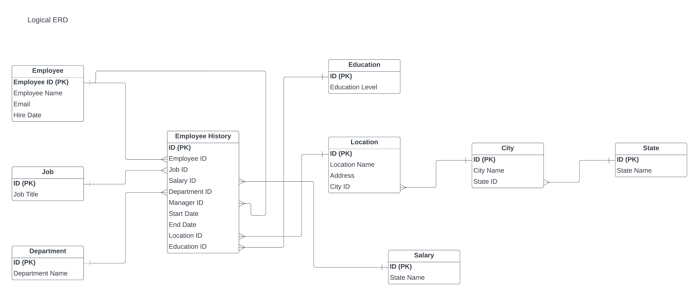
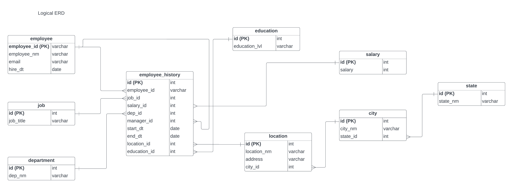

# HR Database - Data Architect Nanodegree Program (Udacity)

## Project Overview

In this project, I will design, build, and populate a database for the Human Resources (HR) Department at the imaginary Tech ABC Corp, a video game company. This project will start with a request from the HR Manager. From there, I will need to design a database using the foundational principals of data architecture that is best suited to the department's needs. I will go through the steps of database architecture, creating database proposals, database entity relationship diagrams (ERD), and finally creating the database itself. This project is important, as it is a scaled-down simulation of the kind of real-world assignments data architects work on every day.

## Business Scenario

Tech ABC Corp saw explosive growth with a sudden appearance onto the gaming scene with its new AI-powered video game console. As a result, they have gone from a small 10 person operation to 200 employees and 5 locations in under a year. HR is having trouble keeping up with the growth since they are still maintaining employee information in a spreadsheet. While that worked for ten employees, it has become increasingly cumbersome to manage as the company expands.

## Dataset

The [HR dataset](https://drive.google.com/file/d/14SgnE_0wNpuPdF5ss94GGqIBfcxLnpIF/view) I will be working with is an Excel workbook consisting of 206 records, with eleven columns. The data is in human-readable format and has not been normalized at all. The data lists the names of employees at Tech ABC Corp, as well as information such as job title, department, manager's name, hire date, start date, end date, work location, and salary.

## Conceptual ERD

## Logical ERD

## Physical ERD

## How to run Project
1. Start project by command: 'service postgresql start && su - postgres' or click button Start Postgres in Guide.
2. Init database by command: 'psql -f /home/workspace/StageTableLoad.sql' or click button Init Database in Guide.
3. Run command to create tables: 'psql -f /home/workspace/DDL.sql'.
4. Run command to insert data to tables: 'psql -f /home/workspace/DML.sql'.
5. Run command to start CRUD, answer questions and challenges: 'psql -f /home/workspace/CRUD.sql'.